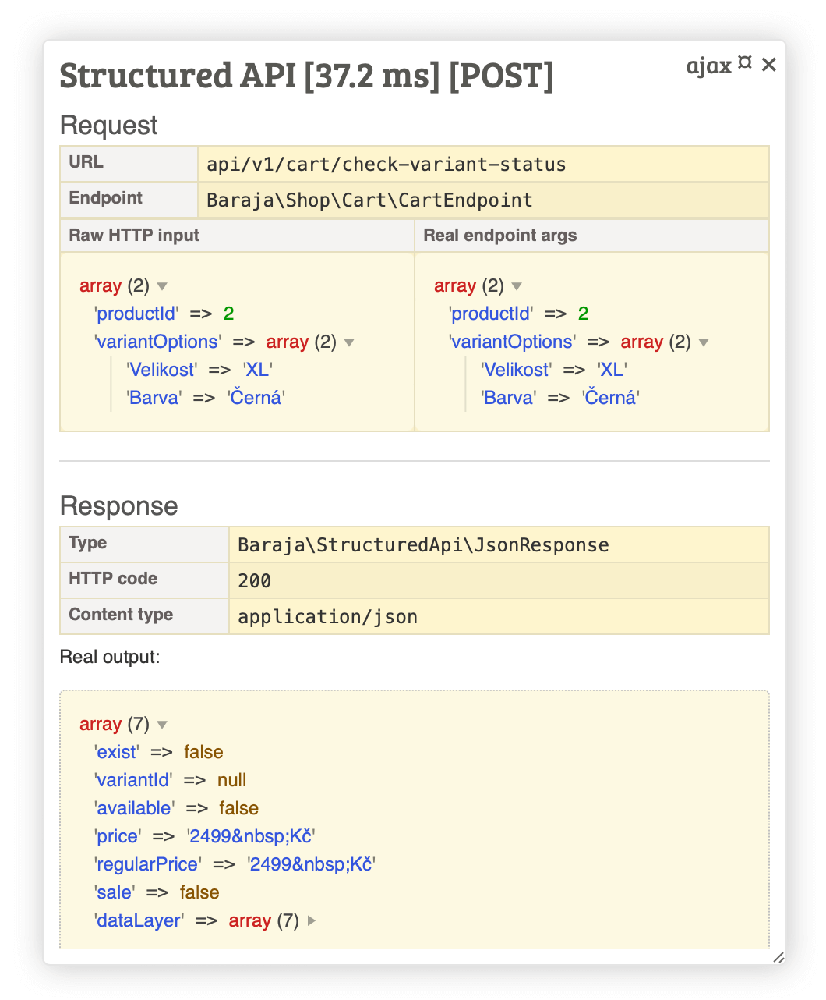

Structured REST API in PHP
==========================


Full compatible smart structured API defined by schema.

- Define full type-hint input parameters,
- Validate returned data by schema,
- Full compatible with Nette framework,
- Inject dependencies by `#[Inject]` attribute (or old `@inject` annotation syntax) in public property.



📦 Installation & Basic Usage
-----------------------------

This package can be installed using [PackageRegistrator](https://github.com/baraja-core/package-manager) which is also part of the Baraja [Sandbox](https://github.com/baraja-core/sandbox). If you are not using it, you have to install the package manually following this guide.

A model configuration can be found in the `common.neon` file inside the root of the package.

To manually install the package call Composer and execute the following command:

```shell
$ composer require baraja-core/structured-api
```

🛠️ API endpoint
---------------

API endpoint is simple class with action methods and dependencies. For best comfort please use your custom BaseEndpoint with declaring all required dependencies.

Simple example:

```php
<?php

declare(strict_types=1);

namespace App\Model;

final class MyAwesomeEndpoint extends BaseEndpoint
{
   /**
    * This is test API endpoint as demonstration of inner logic.
    *
    * @param string $hello some user-defined parameter.
    */
   public function actionDefault(string $hello = 'world'): MyAwesomeResponse
   {
      // The endpoint response can be simply returned as an simple array or typed object.
      // A type object is much better because it will be used as the basis for documentation.
      // It will be automatically converted to JSON.

      return new MyAwesomeResponse(
         name: 'Test API endpoint',
         hello: $hello,
      );
   }

   // or use old syntax:

   /**
    * This is test API endpoint as demonstration of inner logic.
    *
    * @param string $hello some user-defined parameter.
    */
   public function actionDefault(string $hello = 'world'): void
   {
      $this->sendJson([
         'name' => 'Test API endpoint',
         'hello' => $hello,
      ]);
   }

   // or return simple array directly:

   /**
    * @param array<mixed, mixed> $data
    */
   public function postCreateUser(array $data): array
   {
      return [
         'state' => 'ok',
         'data' => $data,
      ];
   }
}
```

Method `actionDefault` is used for request in format `/api/v1/test` with query parameter `?hello=...`.

Method `postCreateUser` will be called by POST request with all data.

Always return the response from the endpoint directly as the return type of the method. This makes static analysis easier for other tools (for example, for checking code integrity or generating documentation). The `sendJson()`, `sendOk()`, and `sendError()` methods are still supported, but may be marked as deprecated in the future.

📝 Endpoint registration
------------------------

If you use the Nette Framework, all endpoints will be registered automatically. This provides an extension for DIC.

To register automatically, simply inherit `BaseEndpoint` or implement the `Baraja\StructuredApi\Endpoint` interface.

🌐 HTTP methods
---------------

The library supports all HTTP methods for the REST API. The selection of the HTTP method is solved by the method name.

You can specify the HTTP method at the beginning of the method name, or use an alias:

```php
final class MyAwesomeEndpoint extends BaseEndpoint
{
   public function getDefault(): void
   {
      // this logic will be called as GET.
   }

   public function actionDefault(): void
   {
      // this logic will be called as GET too,
      // because `action` prefix is alias for GET.
   }

   public function postDetail(string $id, string $name, ?string $description = null): void
   {
      // this logic will be called as POST.
   }
}
```

List of aliases (aliases are optional):

- `action` as `GET`
- `update` as `PUT`
- `create` as `POST`

💾 Obtaining raw data
---------------------

For processing complex data structures, it may be useful to obtain the data in its original raw form.

The library reserves the key variable `array $data`, which always contains the original input values from the user, regardless of validation.

For example:

```php
final class OrderEndpoint extends BaseEndpoint
{
   public function postProcessOrder(array $data): void
   {
      // variable $data contains all raw data from user.
   }
}
```

✅ Validation
-------------

In the runtime, when calling methods, the passed arguments against the method definition and data types are validated. This ensures that the endpoint is never called with incorrect data.

The library guarantees that you will always get the data in the type you request. If you need to define the type more complicated, you can use a comment annotation.

Combined example:

```php
final class ArticleEndpoint extends BaseEndpoint
{
   /**
    * @param string|null $locale in format "cs" or "en"
    * @param int $page real page number for filtering, 1 => first page ... "n" page
    * @param int $limit in interval <0, 500)
    * @param string|null $status matching constant self::STATUS_* (null, all, published, trash)
    * @param string|null $query smart search query
    * @param string|null $filterFrom find all articles from this date
    * @param string|null $filterTo find all articles to this date
    * @param string|null $sort sort by supported field
    * @param string|null $orderBy direction by `ASC` or `DESC`
    */
   public function actionDefault(
      ?string $locale = null,
      int $page = 1,
      int $limit = 32,
      ?string $status = null,
      ?string $query = null,
      ?string $filterFrom = null,
      ?string $filterTo = null,
      ?string $sort = null,
      ?string $orderBy = null,
   ): void {
   }
}
```

The library takes full advantage of PHP 7 and always checks data types. If the data is passed in the wrong type (for example, a boolean cannot be passed by the GET method), it performs an automatic conversion or throws an error.

If the argument contains a default value, it is **automatically marked as optional**. If the user does not pass a value, the default is used. All mandatory arguments **must always be passed**, if not, your logic will not be called at all.

🙋 Smart response
-----------------

The library contains a number of built-in methods for elegant handling of all important return states.

For example, if we want to get the detail of an article by ID and return its detail from the database, the use is completely intuitive:

```php
final class ArticleEndpoint extends BaseEndpoint
{
   public function actionDetail(string $id): void
   {
      // your logic for fetch data from database

      // your response
      $this->sendJson([
         'id' => $id,
         'title' => 'My awesome article',
         'content' => '...',
      ]);
   }
}
```

Each method can return output either via `send` methods or directly as a type object. A more modern approach is to return the entire object, as this gives us type checking and the underlying basis for automatically generated documentation.

> **Warning:** If you do not pass any output (by method or return statement), endpoint processing will fail.

When processing actions, it is a good idea to return success or error information:

```php
final class ArticleEndpoint extends BaseEndpoint
{
   public function createDetail(string $title, string $content, ?string $perex = null): void
   {
      try {
         // creating in database...
         $this->sendOk([
            'id' => 123,
         ]);
      } catch (\Exception $e) {
         $this->sendError('Can not create article because ...');
      }
   }
}
```

🔒 Permissions
--------------

> 🚩**Warning:** If you do not set the rights at all, by default all endpoints are private and you must log in to call them! 👮

All API requests are validated at runtime. If you want to allow all users access to your endpoints, please add the `#[PublicEndpoint]` attribute to class.

For example (this endpoint will be public):

```php
#[PublicEndpoint]
final class ProductEndpoint extends BaseEndpoint
{
}
```

To restrict rights, define an `#[Role]` attribute over a class or method.

For example (only administrators and moderators can call this endpoint):

```php
#[Role(roles: ['admin', 'moderator'])]
final class ArticleEndpoint extends BaseEndpoint
{
}
```

Rights settings can also be combined. For example, in a public endpoint, restrict rights to a specific method only:

```php
#[PublicEndpoint]
final class SitemapEndpoint extends BaseEndpoint
{
   #[Role(roles: 'admin')]
   public function actionClearCache(): void
   {
      // your secured implementation
   }
}
```

🔒 Check API token
------------------

If you want to provide the API to your external partners or to provide secure communication with another application, it is a good idea to use authentication of all requests via an API token. There is an official extension [structured-api-token-authorizer](https://github.com/baraja-core/structured-api-token-authorizator) for this use.

🗺️ Project endpoint documentation
---------------------------------

When developing a real application, you will often need to pass work between the backend and the frontend.

To describe all endpoints, the package offers an optional extension that generates documentation automatically based on real code scanning.

Try the [Structured API Documentation](https://github.com/baraja-core/structured-api-doc).

📄 License
-----------

`baraja-core/structured-api` is licensed under the MIT license. See the [LICENSE](https://github.com/baraja-core/structured-api/blob/master/LICENSE) file for more details.
